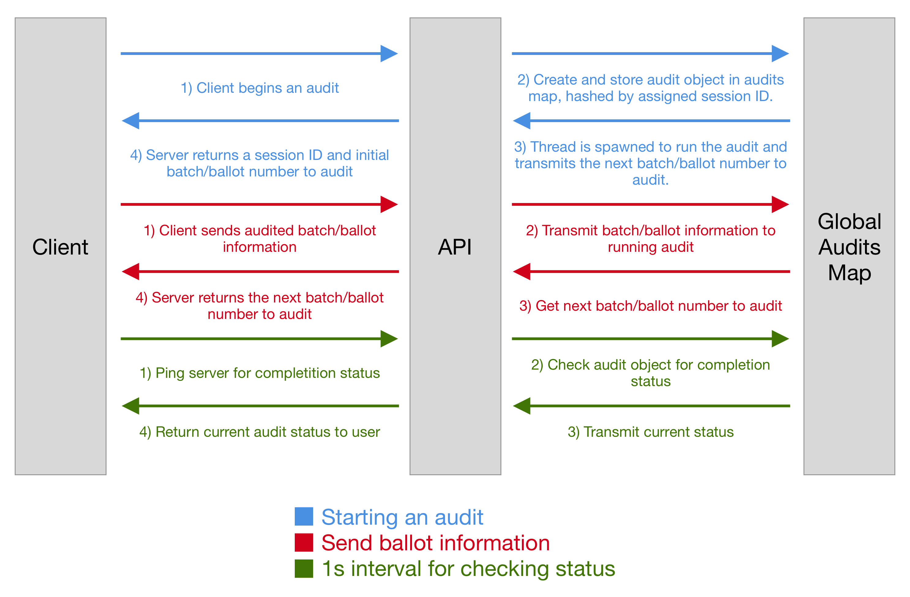

# Introduction
A risk-limiting audit (RLA) is a statistically robust method for testing the authenticity of election results by selecting and hand counting statistical samples of ballots. The process of conducting risk-limiting audit is described in Figure \ref{fig:rla-process}.

After the controversial presidential election in 2000, a number of states spent millions of dollars to modernize their voting machines and infrastructure. The goal was to replace aging and unintuitive punch card voting machines with modern electronic voting systems. Ever since this change was made, a number of cybersecurity experts have raised concerns regarding the security of electronic voting equipment. These concerns finally gained public attention after foreign interference was discovered during the 2016 presidential election. While the results of the election were ultimately accepted, it is plausible that changes to election results may have gone unnoticed. The only way election officials can assess and guarantee the credibility of election results to high statistical certainty is through the widespread adoption of risk-limiting audits. Unfortunately, only three states, Colorado, Rhode Island, and Virginia, currently have statutory requirements for risk-limiting audits according to the National Conference of State Legislatures (NCSL) [@ncsl_2018].

Risk-limiting audits are a subset of election audits that aim to minimize required costs and effort while bounding the probability of an incorrect election outcome being verified. As compared to some other audits seen in practice, risk-limiting audits are generally much cheaper and quicker to perform; risk-limiting audits use randomness and statistics to reduce the number of ballots that need to be checked. At the same time, risk-limiting audits present risk-limit as an independent variable; that is, the significance level is a directly tunable parameter of risk-limiting audits. Thus, policymakers or election officials can set an acceptable risk-limit and be guaranteed that, after an audit, the election outcome is correct with that degree of confidence. Currently, thirty states and Washington D.C. require traditional post-election audits [@ncsl_2018]. Therefore, there is a growing consensus among states regarding the need for post-election audits. That said, while general audits are a great first step, much of the aversion to implementing audits are due to exorbitant costs of inefficient audits.
As more states begin to adopt risk-limiting audits as a way to verify elections, it has become more critical than ever to have a robust and easy-to-use application to guide election officials through the process of conducting RLAs. In particular, there is a need for a modern web application that abstracts out the complex statistical and mathematical calculations and makes the process less intimidating. The difficulties and roadblocks faced in the recent RLA pilot in Michigan emphasize the need for an easy-to-use tool for conducting risk-limiting audits to verify election results.
Any individual who would like to verify election results should be able to easily conduct an RLA without being burdened by mathematical and technical complexity. This was the motivation for our project: we sought to build a web application with modern web standards that is easy-to-use, robust, and powerful and can be harness by anyone who wishes to conduct a risk-limiting audit to verify election results.

.](figures/rla-process.png)

# Background
Currently, only one general tool exists on the web for conducting risk-limiting audits, made by Philip Stark, the inventor of RLAs. Unfortunately, Stark's web application is not user-friendly and is built with aging web technologies such as jQuery. Furthermore, Stark's application only implements two risk-limiting audit techniques: ballot-polling^[https://www.stat.berkeley.edu/~stark/Vote/ballotPollTools.htm] and ballot-comparison^[https://www.stat.berkeley.edu/~stark/Vote/auditTools.htm]. One of the main issues with Stark's website is its lack of usability due to its complicated, plain, and uninviting interface. These make it difficult for a user with limited technical knowledge to navigate and use the site. The lack of instructions and cluttered interface are a major detriment to the application adopting widespread use.

On the other hand, Colorado recently partnered with Free & Fair to create a software system for conducting risk-limiting audits in the state ^[http://freeandfair.us/blog/risk-limiting-audits/]. While the system is open source and open to contribution, it must be installed and run locally and is catered specifically to the Colorado election system. This presents two hurdles: (1) many election officials do not have a technical background and may not be able to configure and install the system locally, (2) the system lacks generality and cannot be directly used in other state elections without potentially tedious modifications. As such, our team sought to create a generalized and easy-to-use tool for conducting risk-limiting audits to supplement and improve on the options currently available.

# Methods
Our web application, `election-audits.org`, implements four risk-limiting audits methods, as described below. Each was written about at length in their introductory papers, and we describe below differences in our implementations, as well as how and why to use them.

## Risk-limiting ballot-polling audit
Our web application faithfully implements the ballot-polling audit as described in [@bravo_2012]. A ballot-polling audit is run by randomly sampling ballots and reporting their votes. The audit creates statistical indicators that keep track of how closely the sampled ballots match the reported election outcome until the audit can confirm the results to a risk limit defined by the user or all ballots are hand recounted. 

To begin our ballot-polling audit, the user first enters the contest information, which includes the number of ballots cast, the number of winners, the candidates and their respective number of reported votes, and audit parameters such as the risk limit and the maximum number of ballots to sample before performing a full hand recount. Our application then performs the initial calculations: determining all the winners, setting initial indicator values for all candidates. The audit then asks the user to randomly sample ballots and report their outcomes. If the candidate indicator values are below a tolerance value defined by the risk-limit after the initial sample, the audit confirms the reported results and ends. Otherwise, the user keeps sampling ballots until the indicator values are low enough to confirm the reported results or all ballots are counted. 

## Risk-limiting ballot-comparison audit
Our website implements a ballot-comparison audit based off [@Stark_2010]. Ballot-comparison audits are more efficient than ballot-polling audits by comparing reported votes for a given ballot to the actual markings. In doing so, the ballot-comparison audit seeks to identify counting errors---mismatches between the digitized ballot and the paper ballot. The audit is run in rounds: each round sampling a small number of ballots. If the audited ballots' recorded votes sufficiently match the original cast vote record (CVR), the audit may stop. The audit uses simple rules to select a sample size in one round to perform a risk-limiting audit if the error rate is sufficiently low. 

Our ballot-comparison audit follows the guidelines outlined in the paper for selecting an initial sample size. The user enters in the number of ballots cast, the number of candidates and their respective reported votes, risk-limit, inflation rate, and tolerance to determine an initial sample size to audit. The algorithm keeps track of overstatements and understatements to each candidate's reported votes. In addition, the algorithm updates a Kaplan Markov MACRO $P$-value which is used if the audit moves past the first round. After the initial ballots in the sample size are audited, the algorithm checks to see if any winner’s reported votes are overstated by more than an overstatement tolerance derived from the user’s audit parameters. In the case that a two-vote overstatement is found when auditing the initial sample, the algorithm will exit and ask the user to do a full hand recount. If the number of overstatements for the reported winners is less than the overstatement tolerance, the audit will end confirming the reported results. In the case that at least one winner has more overstatement errors above the overstatement tolerance, more ballots are audited until the Kaplan Markov MACRO P-value is below the risk limit or all ballots are counted.

Our algorithm implementation makes a few conservative assumptions for simplicity and to handle contests with multiple winners. For contests with multiple winners, we trigger full hand-recounts for both two-vote overstatements to one candidate’s reported votes or more than one one-vote overstatement on the same ballot. In addition, our ballot comparison audit doesn't support ballots with more than one contest yet. 

## Bayesian audits
A Bayesian audit works differently than risk-limiting audits, in that the audit "upper bounds the probability (average risk) that similar collections of paper ballots give outcomes different than the reported one" [@Malagon_Rivest_2018].  To election officials, Bayesian audits are different in that some hand-counting of paper ballots occurs before the audit begins: some $n$ ballots are sampled and the “sample tallies” (votes for each candidate) from those ballots are used to seed the Bayesian audit. The audit then uses this sample data to run simulations of elections and report the fraction of simulations each candidate won. If the winning candidates match those reported and the projected win probabilities are sufficiently high, then the election results are considered verified.  While there is much to be said about Bayesian audits (see [@Rivest_2018]), [@Malagon_Rivest_2018] gives a succinct, single-page explanation of their details.
We implement a Bayesian ballot-polling audit using Ron Rivest's [bptool](https://github.com/ron-rivest/2018-bptool) and ensure the reported and projected winners match with statistical confidence (i.e., the projected winners won more than $1 - (\text{risk limit})$ of the simulations).  The interface of this method is similar that that of the others implemented, except for the front-loading of counting. After some ballots have been counted and reported to the website, election officials need only sit-back (for a half-second) as the election projections are run.  Similarly to our other methods, the output either states that election results are confirmed or more sampling is necessary. While Rivest’s bptool supports multi-county audits, we decided to implement only single-county audits to be consistent with our other methods. As part of this project, we contributed documentation fixes upstream to improve usability.
Ron Rivest also has a similar [ballot-comparison tool](https://github.com/ron-rivest/2018-bctool), but it does not support multiple winners at this time. If we were to implement a Bayesian ballot-comparison method, we would also upstream multiple winner support.

## Risk-limiting canvass audits
Our website implements a canvass audit (suitable for multi-batch elections) like that described in [@Stark_2009].  These audits are run in stages: each stage samples a select number of batches. If the relative overstatement between the reported votes and the audited votes in any individual batch of ballots is larger than a user-defined error tolerance, the audit will continue to the next stage. 

The user first enters in the candidates, the number of winners, the number of batches, the reported number of votes for each candidate within each batch, the number of stages, the risk tolerance and the threshold of escalation. The algorithm then calculates the risk tolerance for each stage and randomly selects the batches to audit for that stage. Once the user finishes hand counting the batch and enters the actual votes, the relative overstatement of each batch is calculated. If the maximum relative overstatement of audited batches is larger than the selected threshold, the audit will progress to the next stage or request a full hand recount if already at the final stage. Otherwise, the audit has confirmed the election results.

To provide a more user-friendly application, our implementation of the canvass audit differs in two ways from [@Stark_2009] implementation. Our canvass audit algorithm only accepts equally-sized batches and the risk tolerance and threshold of escalation user parameters are set before the audit and are constant for all stages.

# System
Currently, there are no simple and accessible tools for conducting risk-limiting audits (RLAs). Philip Stark, who has pioneered RLAs, currently has two online tools for conducting audits: one for ballot-comparison audits and one for ballot-polling audits. The tools, while powerful, are very hard to use by an election official with no math or statistics background. In addition, the web application does not follow the latest web standards such as HTML5 and JavaScript ES6. Tthe web pages that host the tools are cluttered with massive blocks of text explaining the audit techniques and how they work. While this information is helpful to statisticians, a regular election official may find these explanations overwhelming and complex, thus it is critical to make a modern web application that implements a number of risk-limiting audit techniques available to all, not just the math-literate.

Recently, a number of state election officials have begun to evaluate the use and feasibility of risk-limiting audits in state elections. Thus, it is more critical than ever to have a usable web application for conducting these audits. That is what our group sought to do: create a usable, fast, and powerful web application that election officials can use to conduct risk-limiting audits for their local elections.

Our front-end was composed of a number of static web pages and used JavaScript for interactivity and guidance through the audits. The front-end was made up of 6 primary web pages: the homepage, ballot-polling audit, ballot-comparison audit, canvass audit, Bayesian ballot-polling, and the sample size demo. Each audit web page included a simple web form that a user filled out with initial audit parameters and a button to begin the audit. Once a user begins an audit, the front-end will guide the user through the rest of the process and will display an alert when the audit has concluded. The audit conclusion alert includes a recommendation, either to perform a full hand recount of the ballots or that the results stand in their current state.

The front-end was connected to a back-end built using Python 3 and Flask. The back-end was responsible for conducting the audits and maintaining the audit state across users sessions. There were a few important design decisions to be made in terms of client-server architecture (depicted in Figure \ref{fig:system}) and the way in which the back-end would process the front-end requests. This was more challenging than we originally thought it to be because most of the implemented audit methods required continuous input from the user. Once the user inputs the required information, based on the current state of the audit method calculation, the server takes in the newly submitted information and continues performing the relevant calculations. Then, depending on the input and calculations, the audit either requires more information or halts. Relaying the audit status (i.e., running or halted) from the back-end to the front-end proved to be more difficult than anticipated: for a single-user system, a single API call works fine because once the calculation is ready for more user input, it returns a specific message to the front-end; however, this falls apart with multiple users and audit requests. Calculations may be time intensive and multiple requests may be blocking due to long calculations bottlenecking the application. We solved this by offloading the work of the calculation to another thread, which relieves the main thread from running computations and waiting on user input, which keeps it open to receive other incoming requests. This solution introduced an issue that simple returns from API calls couldn't be used to send updates on calculations back to the client. To solve this issue, we introduced a second request to ping the server and check on the status of the audit the client was running. This made it possible for the client to be updated once the audit was complete or needed more input. 

# Evaluation
The front-end interface was made with usability in mind. In particular, the audit web pages are composed of web forms that people commonly interface with when browsing the web. These forms are prefilled with reasonable default values (recommended values from the papers, where applicable). We also made an effort to make the colors of elements and the page formatting intuitive.

Regarding performance, our website is built with a Python Flask back-end that makes use of threading to ensure that calls to our heavy computation functions are non-blocking. The front-end is hosted on an Nginx web server to ensure support for thousands of concurrent requests. Both our front-end and back-end are served on a quad-core Digital Ocean instance.

In addition to the above user experience improvements, there are also a few things we would like to improve upon with regards to system design. In terms of the front-end, static web pages are used to present data to the client. While this worked for a proof-of-concept demo, it makes the site much less dynamic. Since the reach goals for this project were to have an advanced level of interaction with the user using a dynamic interface, it would make sense to switch to a front-end design that is more flexible, and more modular. Currently, the front-end uses a lot of repetitive code to produce the pages, and using a more dynamic framework such as React.js or Vue.js will enable a cleaner code base. It will also help with scalability since we would be able to add more audit methods without repetitive code. 
In terms of the back-end, there were a few issues with the implementation that we would like to improve upon. The first is duplication in the API code. The current system uses a single API route to receive the request for an audit, and then parses the argument based on the passed in parameters. Due to time restraints in the project and sub-optimal planning, duplicate code was produced and made the API code hard to maintain. Therefore, one further reach goal is to write better abstractions to make the codebase cleaner and more maintainable.

Another back-end issue that should be fixed is the class-structure of the individual audit methods. Currently, there is one base method class that all method classes inherit from. This initial abstraction made for efficient code reuse. However excluding some shared properties, the audit methods individually each had their own structure, variables, and methods. This made it difficult to unify running the audits through an interface and could be simplified for ease of use and scalability. 
Bugs are an inevitable part of any software system. A lot of the bugs in our solution were due to edge cases in the algorithms. Furthermore, due to the time constraint with the project and the fact that some of these audits were difficult and time-consuming to test, it was difficult to thoroughly test our implementations for some of the audits, specifically the canvass audit, which required a large number of batches to produce any meaningful results. To combat this problem in the future, a testing tool can be made to make efficient testing methods for each audit method. 

# Results
As more states adopt risk-limiting audits, it is critical to create an application that election officials can easily use to carry out and be guided through a RLA. Currently, one of the only tools available for conducting risk-limiting audits is hosted on Philip Stark’s personal website. His web application is outdated, hard-to-use, and does not conform to the latest web standards. Our project sought to improve on the shortfalls of Stark’s tool and to introduce extra features such as two additional audit techniques (canvass and Bayesian ballot-polling), a tool for assessing the effect of risk limit on initial sample sizes of ballot-polling and ballot-comparison audits, and an introduction page outlining what a RLA is and the different audit techniques. We made sure that our audit implementations abstracted out most of the complex math and left the users with a linear experience that required simple data entry. Our group thought that these improvements and additions would help make risk-limiting audits easier to use and less daunting for the less technical audiences.

# Conclusion
Our group created a robust and easy-to-use web application that guides users and election officials through the process of conducting risk-limiting audits, which will be beneficial to election officials for auditing future elections, especially as the adoption of risk-limiting audits increases. While the modern web application our group created is simple and functional, there are still a number of improvements that can be made. Namely, our group would like to further refine the user experience by adding tool-tips and pop-ups to explain different terms that are exclusive to the different audit techniques (e.g. risk limit, tolerance, threshold). Secondly, we would like to explore the feasibility of adding a tool that can recommend the type of audit technique to use by absorbing certain election metrics and a specified audit goal. Finally, our group would like to create a comprehensive test suite to ensure that our audit techniques are working accurately and properly. This is especially critical since our tool may be used in the future by election officials to verify the results of real elections. We would like to unit test both our back-end computations and our front-end interface.

Our tool's goal is to improve access and understanding of risk-limiting audits. Risk-limiting audits are an active research topic and proven to reveal tampered election results. Despite these advantages, risk-limiting audits are not widely used across elections. Since most election officials don’t have an intensive math and statistics background it can be hard for election officials to choose and implement a risk-limiting audit. Following the 2016 presidential election cyberattacks, election cybersecurity has become a widely followed topic. Cyberattacks are a legitimate and insidious threat to election integrity. Election officials should enforce preventive measures against cyberattacks. Risk-limiting audits are one such measure. Our website, [`election-audits.org`](http://election-audits.org), is an easy and effective tool for election officials to use in an age of growing cybersecurity threats. 

\newpage

# References
\noindent
\setlength{\parindent}{-0.5in}
\setlength{\leftskip}{0.5in}
